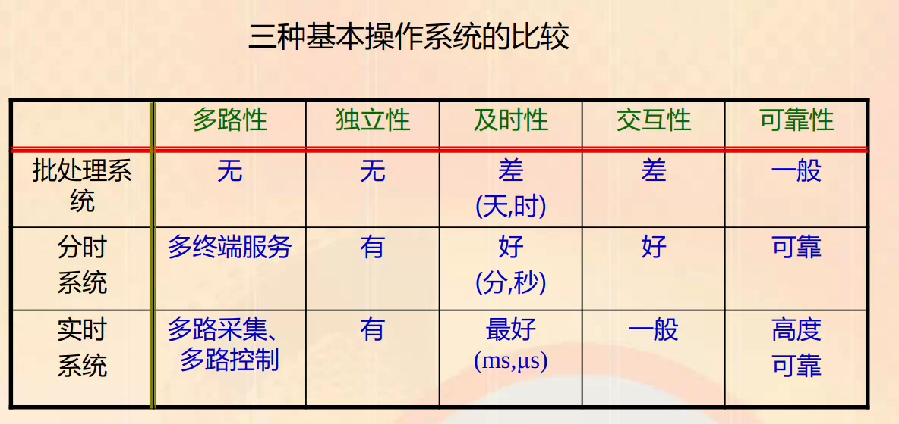
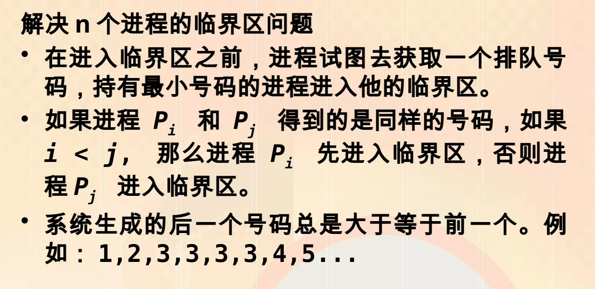
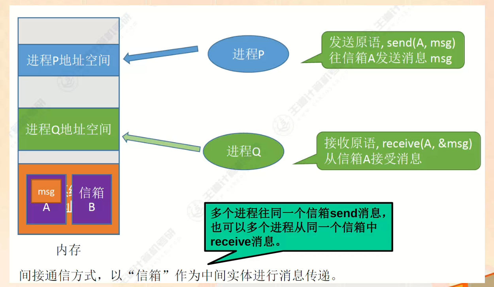
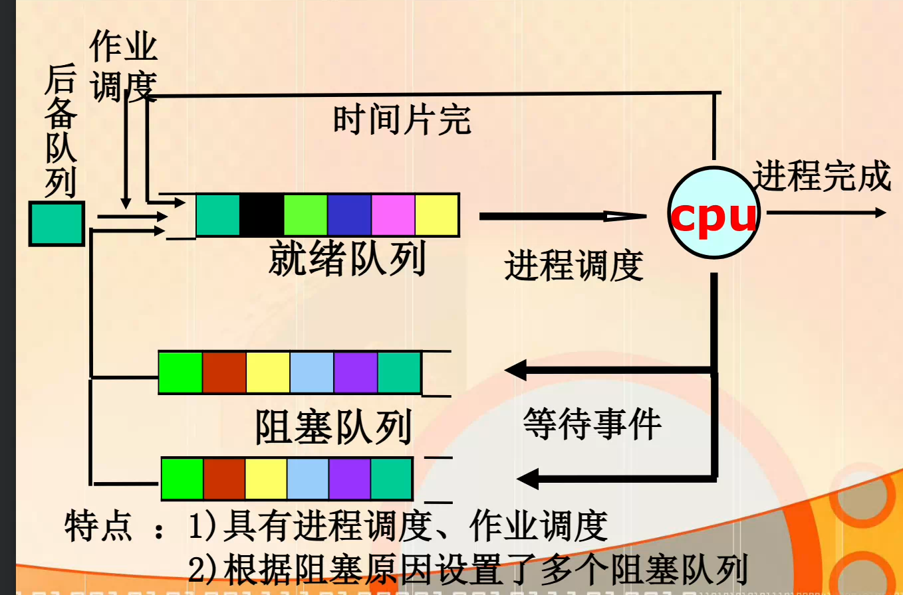
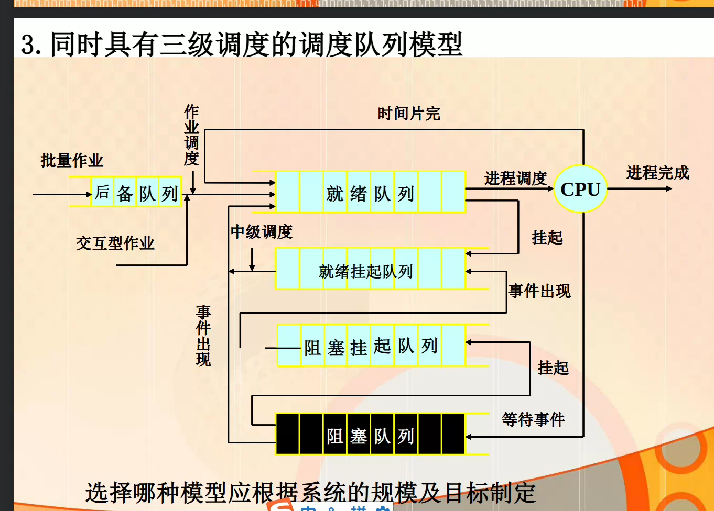

# 第一章 概论
1. 单CPU；多任务；CPU能和外设并行操作。
## 什么是操作系统
1. OS定义：是配置在计算机硬件上的第一层软件，是对硬件系统的首次扩充.OS是**直接控制和管理计算机硬件、软件资源，合理地对各类作业进行调度**，以方便用户使用的程序集合；完成硬件相关，应用无关的操作。
2. 引入OS的目标：
   1. 有效性：合理分配软硬件资源，组织工作流程
   2. 方便性：提供用户对硬件的接口
   3. 可扩充性：系统互操作，硬件拓展
## 操作系统历史
1. 无操作系统阶段：
   1. 串行，用户人工操作，用户独占全机
   2. 利用率 = 执行时间/(执行 + 读卡时间)
2. 单道批处理系统:
   1. 使用系统提供的作业处理语言JCL将所有作业输入，之后用户不在干预，*提高了利用率*
   2. 一个作业包括：用户程序、数据和作业说明书（作业控制语言）
   3. **批**：一个包含多个作业的，供一次加载的磁带或磁盘，使用一组相同的系统软件
   4. 自动性，顺序性，单道性
3. 多道批处理系统：
   1. 通过作业调度算法，将用户作业放入*后备队列中*，使得作业共享CPU资源（IO和CPU共同工作）。
   2. 宏观上并行，利用率高，但用户交互性差。微观上串行，各任务交替使用CPU。
## 操作系统基本类型
批处理操作系统、分时操作系统、实时操作系统。同时拥有两个以上的称为*通用操作系统*
1. 分时：一台计算机的一个周期分给多个用户使用。
   1.  时间片：将系统资源（尤其CPU时间）在时间上进行分割，每个时间段称为*时间片*，每个用户轮询使用时间片
   2.  分时技术：将处理机时间分成时间片，分配给各联机作业使用
   3.  分时操作系统：是一种联机的*多用户交互式的操作系统*。对每个用户能保证足够快的响应时间，并提供交互会话能力。
   4.  特征：交互性（用户和系统人机对话），多路性（多用户用一个机器），独立性（每个用户独立），及时性（用户能在短时间内获得响应）
2. 实时系统：
   1. *在规定的时间内*完成事件处理。
   2. 分类：
      > 实时控制系统:计算机控制系统，以计算机为核心控制生产过程
      > 实时信息处理系统:响应远程用户的提问，对信息进行检索等.
   3. 实时任务分类：周期性/非周期性
3. 
4. 其他分类：
   1. 多处理机操作系统
      > 紧密耦合,松散耦合
      > 非对称式多重处理,对称式多重处理
   2. 网络操作系统：还能提供网络通信+网络服务。低耦合，以“协议”连接
   3. 分布式操作系统:分散处理和控制，以计算机网络为基础的；高耦合，统一的os
   4. 个人计算机操作系统：
      > 单用户单任务：只允许一个用户上机，且只允许用户程序作为一个任务运行
      > 单用户多任务:只允许一个用户上机，但允许将一个用户程序分为若干个任务并发执行
## 操作系统基本特征
最基本特征：并发、共享，两者相互存在关联。只有并发才能共享。
1. 并发：多个任务在同一*时间段*发生，操作系统要管理这些并发；并行：同一*时刻*发生。
2. 共享：多个进程**共享有限的计算机系统资源**。操作系统要对系统资源进行合理分配和使用。资源在一个时间段内交替被多个进程所用。
   1. 互斥共享：资源分配后不能被其他进程使用。如打印机
   2. 同时访问，如磁盘文件。
3. 虚拟：一个物理实体（CPU，磁盘）分成多个虚拟逻辑实体（分时，分空间）
4. 异步性：不确定性，进程执行顺序和时间不确定（由于分时等操作）
## 操作系统功能
操作系统组成：
1. 管理模块：针对不同管理对象的程序模块（核心kernel）
2. 用户接口：如外壳(shell)、窗口系统。在shell中，通过运行其他程序来完成各种功能
##### 处理机管理
进行*处理机资源调度*等问题。
1. *进程控制*：进程创建，撤销，挂起等。
2. *进程同步*：同步进程之间的*推进步骤*，分配处理机资源，确保*并发*的作业进程资源共享（互斥，同步方式）
3. *进程通信*：进程之间的数据交互。（读取进程，处理进程，打印进程）
4. *进程调度*：
   1. 作业调度：从作业的*后备队列*中选取若干个创建进程
   2. 进程调度：从进程的*就绪队列*中选取一个执行。
##### 存储管理
目标：提高利用率、方便用户使用、提供足够的存储空间、方便进程并发运行
1. *存储分配与回收*
2. *存储保护*：保证进程间互不干扰、相互保密；
3. *地址映射*：进程逻辑地址到内存物理地址的映射；
4. *内存扩充*：提高内存利用率、扩大进程的内存空间。
##### 设备管理
目标：方便设备使用、提高CPU与I/O设备利用率
1. *设备操作*：通过驱动程序完成对设备的操作。
2. *设备独立性*：提供统一的I/O设备接口，使应用程序独立于物理设备，在同样的接口和操作下完成不同的内容
3. *设备分配与回收*：在多用户间共享I/O设备资源。
##### 文件管理
解决软件资源的存储、共享、保密和保护
1. *文件存储空间管理*：为文件分配外存空间，提高外存效率
2. *目录管理*：解决文件检索问题
3. *文件的读写管理和存取控制*：根据用户需求从外存中存取数据。还要求文件保护，防止没有权限的用户读取。
4. 软件管理：版本管理，依赖管理等
##### 用户接口
*提供一个访问操作系统的友好接口*。一般有命令或系统调用。
1. *命令接口*：
   1. 联机用户接口.为联机用户提供,由键盘操作命令及命令解释程序所组成
   2. 脱机用户接口（批处理用户接口），为批处理作业的用户提供.由JCL组成
2. *程序接口*：用户程序获取系统资源服务的接口，由一组系统调用组成
3. *图形接口*：用户鼠标操作
## OS系统设计
1. 无结构操作系统：由众多过程构成
2. 模块化操作系统结构：模块化程序设计，将OS划分为多个小模块，小模块又分为更多模块。但划分根据功能，*没有区别对待共享资源和独占资源*。
3. 分层式操作系统结构：OS划分为多层，*每一层只能调用低层服务*。
4. 微内核的OS结构：OS内核只实现基本功能，*其他服务由用户态的进程实现*，C/S模式。用户程序（Client）通过OS内核向OS进程（Server）发送请求来获取系统服务。
## 双模式操作
1. 内核程序是操作系统最重要的程序。操作系统有内核Kernel就够了，但操作系统不只有内核（还有可视化界面等）。
2. 只有Kernel可以执行特权指令（内存清空等）。所以**CPU状态**分为：
   1. 内核态：管态，内核态，特权模式
   2. 用户态：目态，用户模式
3. 在PSW程序状态字寄存器中存在一位用于表示管态和目态。
4. 管态和目态切换方式：
   1. 管--目：一条特权指令，设置PSW对应位为用户态（目态），*表示操作系统主动让出控制权*
   2. 目--管：*由中断引发，只有当需要操作系统处理时，操作系统才强制夺回CPU控制权*；或当用户程序需要调用系统服务时切换。
5. 双模式操作目的：可以确保系统和用户程序不受错误的用户程序的影响.
6. 进行I/O保护：*所有I/O指令都是特权指令*
7. 存储保护：*防止进程访问其他进程内存，必须通过系统调用才能访问OS核心区*；增设**基地址寄存器，界限寄存器**，用以记录进程基地址和使用内存大小。
   1. 核心态（管态）可以访问任何内存（Kernel和用户进程空间）
   2. 设置基地址，界限寄存器的指令是特权指令。
8. CPU保护：存在硬件设置*时钟*，每个用户进程每N毫秒（时间片）中断一次，将CPU还给操作系统，*是实现分时系统的基础*；修改时钟指令是特权指令。
# 第二章 进程的描述与控制
进程：一个具有一定独立功能的程序在一个数据集合上的一次动态执行过程。*是处理机，存储器和外设的最基本单位*
## 程序的执行特征
1. 顺序执行：单道批处理。有顺序性（顺序执行）、封闭性（独占全部资源）、可再现性（初始条件相同则结果相同）。
2. 并发执行：*如果不进行额外处理*，则有间断性（运行中可能中断）、非封闭（共享资源，可能被其他进程修改不变特征）、不可再现。所以必须要**额外操作来保证封闭性和可再现性**
## 进程的定义和特征
1. 进程中包含：
   1. 程序代码
   2. 程序数据、堆（程序员分配，malloc、new等，以链表形式存储）、栈（系统自动分配）
   3. PC等寄存器值
   4. 一组系统资源
2. 进程和程序：
   1. 程序是进程基础，进程是程序功能体现
   2. 程序是*静态*的，进程是*动态*的
   3. **通过多次执行，程序可以产生多个进程；通过调用关系，进程可以调用多个程序**
3. 进程特征：
   1. 动态性：创建产生，调度执行，撤销消亡。拥有*动态地址空间*。
   2. 并发性：内存中有多个进程，宏观上同时执行
   3. 独立性：除非相互通信，否则内存相互独立，*是资源调度的基础*
   4. 异步性：每个进程按照独立的速度进行
   5. 结构性：进程控制块(PCB，位于核心区) +  程序 +  数据 =  进程实体
## 进程控制块PCB
进程控制块（PCB，Process Control Block）是描述进程的数据结构，*记录用于描述进
程执行情况及控制进程运行的全部信息*。
1. 进程组成：
   1. PCB：操作系统为每个进程都维护一个PCB，保存进程的动态特征。
   2. 代码块：描述进程功能
   3. 数据块：描述操作对象和工作区
2. **PCB是进程存在的唯一标识**
3. PCB位于*核心区*，只能通过系统调用间接访问
4. PCB有什么：
   1. **进程描述信息**：进程标识符（内部标识符）；进程名（外部标识符）；父进程标识；用户标识符
   2. **处理机状态信息**：保存运行现场（PC，通用寄存器，PSW，栈指针）
   3. **进程调度信息**：用于操作系统调度；包括进程当前状态，优先级，运行统计信息等
   4. **进程控制信息**：程序段和数据段的地址；进程间同步和通信；资源占用信息（剩余资源）；链表存储的下一个进程指针。
## 进程基本状态

## 进程调度队列
操作系统维护很多队列，*用于表示进程状态*，如就绪队列，各种阻塞队列等；每当PCB记录的状态改变时，会脱离原先队列而加入正确队列。
1. PCB组织方式
   1. 链表
   2. 索引表：同一个状态的PCB装入同一个index表，一个index指向一个PCB。
2. PCB进程切换:
## 进程控制
*进程管理中的最基本功能*
1. 进程生命周期：创建、运行、等待、唤醒、终止
2. 进程控制任务：进程的*创建、终止、进程状态的转变*等
3. 进程控制*由OS内核的原语*完成。
> 原语：由若干条指令构成的“原子操作(atomic operation)” 过程；
> 许多系统调用是原语，但原语不一定是系统调用。

4. 内核Kernel功能：*支撑功能；资源管理功能*
##### 进程创建
1. 父子进程：PCB中包含家族关系表项；子进程可以继承父进程资源，撤销子进程需要归还继承的资源；撤销父进程必须同时撤销子进程。
2. 进程创建定义：发生创建新进程事件后，*调用进程创建原语Creat()创建新进程*
3. 引起进程创建的事件：
   1. 系统初始化（系统内核创建）：分时系统的用户登录；批处理系统的作业调度。
   2. 提供服务（系统内核创建）：*用户请求创建进程*
   3. 应用请求（应用自己创建）：应用调用了原语Creat()
4. CREAT()原语：
   1. 申请空白PCB.
   2. 新进程分配空间.
   3. 初始化PCB：标识符；设置PC、SP；进程状态、优先级
   4. 插入就绪队列
##### 进程终止
1. 终止分类
   1. 正常结束：exit
   2. 异常结束：越界错误、超时错误等
   3. 外部干预：系统kill，（被）父进程终止
2. 终止过程
   1. *查询进程状态*：PCB表中检索出对应PCB，查询对应状态。
   2. *终止执行进程*：若处于执行状态则终止，设置调度标志为真并重新调度。
   3. *终止子进程*
   4. *释放资源*：将资源还给父进程，释放内存和lock
   5. *移除PCB*：将PCB从队列中移除
##### 进程的阻塞
1. 引起阻塞的条件
   1. 请求系统服务
   2. 启动操作
   3. 新数据尚未到
   4. 无新工作可做
2. 阻塞过程
   1. 若正在运行态，则调用阻塞原语BLOCK()，进入阻塞态。（是进程的主动操作）
   2. 引起处理机调度
3. Block()
   1. 保存当前CPU现场
   2. 置PCB阻塞态
   3. 进入等待队列
   4. 引起调度
##### 进程唤醒
1. 唤醒原因：等待的事件到达
2. 当其他进程发送信号到唤醒进程后，设置PCB状态为就绪。
3. WAKEUP()原语：
   1. 从等待队列中摘下被唤醒进程
   2. 置为就绪态
   3. 进入就绪队列
   4. 进程调度
4. Block()和WAKEUP()是功能相反的原语，*一个进程Block后一定要Wakeup*
5. 
##### 进程挂起
1. 挂起原因：
   1. *终端用户请求*：用户发现进程有问题，请求暂停
   2. *父进程请求*
   3. *负荷调节需要*：资源紧张时，将低优先级进程等暂时不执行的进程挂起，腾出空间
   4. *操作系统的需要*：检查资源或记账使用
2. 挂起作用：合理且充分地利用系统资源；进程挂起时，不在内存中，*仅在磁盘上存在镜像*
3. 挂起原语：SUSPEND():
   1. 将进程从内存调到外存，修改状态（PCB不修改）
   2. 若处于活动就绪/活动阻塞状态，则修改为静止就绪/静止阻塞
   3. 若运行，则重新调度
4. 激活原语：active():
   1. 原因：父进程或用户进程请求，或内存已有足够空间
   2. 从外存调入内存，改变进程的状态
5. 
## 进程同步
进程具有**异步性**的特征。
*异步性*：各并发执行的进程以各自独立的、不可预知的速度向前推进。必须要通过某种机制同步起来
1. 进程之间的制约关系：
   1. 间接制约：两进程之间*资源共享*导致的制约
   2. 直接制约：进程间相互合作导致的制约
2. 临界资源：一个时间段内只允许一个进程使用的资源称为临界资源
##### 有限缓冲区的生产者与消费者问题
**生产者进程生产的信息由消费者进程消费**
假设生产者和消费者对于缓冲区有一个变量counter用于记录缓冲区数据数量。
1. 问题所在：
   1. 生产者生产数据后需要counter++;消费者消费数据后需要counter--
   2. 对应汇编代码：
   ```
   // 生产者
   LOAD Reg1 counter
   inc Reg1
   Store counter Reg1

   // 消费者
   LOAD Reg2 counter
   dec Reg2
   Store counter Reg2
   ```
   3. 当并发处理时，生产者和消费者汇编代码可能出现问题
   
2. *进程并发地共享数据导致不一致性*。需要保证counter++和counter--都是原子操作：**全过程无间断一次完成**
##### 互斥方式实现对临界资源的共享
1. 临界资源：硬件或软件（如外设、共享代码段），多个进程在对其进行访问时（关键是进行写入或修改），必须互斥地进行。
2. 临界区：
   1. 临界区是进程访问临界资源的一段代码，进入临界区后，*不允许其他进程进入各自的临界区*
   2. 进入区：进入临界区前检查是否可进入的代码。若可进入则设置”正在访问临界区“标志位。
   3. 退出区:清除“正在访问临界区”标志
   4. 剩余区：其他部分代码
3. 处于临界区时，说明这个进程正在使用处理机，*此时可以进行调度*。但存在一些不能调度的情况：
   1. 中断处理
   2. 处于系统内核的临界区时
   3. 处于必须不能中断的原子操作时
##### 同步机制需要满足的
1. 空闲则入：临界区能够进入则进入
2. 忙则等待：临界区满则进入等待
3. 有限等待：不能死等
4. 让权等待：不能进入临界区则让出控制器（转换到阻塞态）
##### 临界区同步算法
1. 2个进程同步：Peterson算法
2. n个进程同步：面包店算法：
##### 中断屏蔽方法(硬件)
也可以使用中断屏蔽来确保进程的原语性.
1. 过程
    1. 当某个进程访问临界区时,*关中断*,此时不会发生进程切换
    2. 访问临界区结束后,*开中断*,此时可以进行切换
2. 不适用于多处理机,**只适用于系统内核进程,不适用于用户进程**,原因:开关中断指令只能运行在内核态,是特权指令,不能给用户随意使用.
##### TS指令(TestAndSet)(硬件)
1. 也称为Test and set lock指令,*用硬件实现*,执行过程不允许中断.
2. .png)
3. 适用硬件实现,简单快捷,适用于多处理机环境.但*不符合让权等待*,会一直忙等,占用CPU进行循环
##### Swap/Exchange/XCHG指令(硬件)
1. 硬件实现,执行过程不允许中断.类似TS指令,先记录原lock值old,再上锁(lock=true),查看old是不是false,如果是false则说明没人访问临界区,可以访问.
.png)
2. 不符合让权等待.会死等.
## 信号量机制(semaphore) 
##### 信号量设计
信号量是OS提供的管理公有资源的有效手段.
1. 整型信号量:*使用S整型和两个原子操作来标记资源数量,有多余资源则占用一个资源-1,用完退出资源+1*
.png)
2. 记录型信号量
    1. 一个结构体S,包含`int count`,表示*某种*资源数量;一个`PCB链表 queue`表示阻塞在此信号下的进程的PCB队列.
    2. P原语(Wait):
    ```C
    --s.count;
    if(s.count<0){
        BLOCK(s.queue); // 资源量不够则阻塞请求资源的进程,且放入等待队列中.
    }
    ```
    3. V原语(Signal):
    ```C
    ++s.count;
    if(s.count <=0){
        WAKEUP(s.queue); // 释放时增加资源量,并唤醒等待队列的第一个阻塞进程
    }
    ```
    4. `S.count >= 0`:表示剩余资源量
    5. `S.count < 0 `:小于0时,绝对值表示阻塞的PCB量
    6. `S.count`初值为1时,表示只允许一个进程访问临界资源,*实现互斥* 
    7. **进程共享的资源量越多,越容易造成死锁**
3. AND型信号量
    1. 思想:一次性将需要的资源给到进程,只要有一个资源不够就全都不给
    2. 原子操作同时wait:`Swait()`;同时Signal`SSignal`
    3. 注:Swait中,若对于某个$S_i$不够,则将该进程放入$S_i$的等待队列并阻塞,然后回到Swait起点.
    .png)
4. 二进制信号量
    1. 二进制信号量`bin S1=1,bin S2=0,int C=共享资源初值`
    2. 可用于实现整型信号量
5. 信号量集
    1. 为了一次获取多个资源,拓展AND型信号量:`S`信号,`t`下限值,`d`需求量
    2. .png)
    3. 信号量集的使用例:
        > 1.Swait(S,d,d):一次分配d个资源,资源量少于d不予分配
        > 2.Swait(S,1,1):退化为记录型信号量(S>1);互斥信号量(S=1)
        > 3.Swait(S,1,0):可控开关,当`S>=1`则可以进入多个进程,`S=0`就都不能进.
##### 信号量应用
1. *实现临界资源的互斥访问*
设置一个互斥信号量`mutex=1`,并将原语`Wait(mutex)`和`Signal(mutex)`放在临界区上下.
```C
semaphore mutex = 1;   
do{
    …
    wait ( mutex );
    critical section
    signal( mutex );
    remaider section
}while (true);
```
> 注意:`wait`和`Signal`必须成对出现,缺少wait则不能互斥访问临界资源,缺少signal则资源不会被释放.
2. *实现同步操作*:
    1. 前驱关系:并发执行的进程`P1,P2`,要求对应代码`C1`在`C2`之前完成
    2. 设置互斥信号量`S12 = 0`.
    ```C
    C1;
    signal(S12)

    ///
    wait(S12)
    C2;
    ```
    3. 必须等C1结束后S12++,C2才能跳出wait()执行.
3. *同步操作例题*:
    1. .png)
    2. .png)
## 管程的基本概念
管程是一种*进程同步方法*.
1. 为什么引入管程:当使用信号量同步时,若同步进程过多,信号量分散,导致管理困难,容易死锁.
2. 管程目的:记录资源,所有访问资源的进程必须通过管程,且管程只允许一个进程访问,实现了互斥.*但使用信号量的效率比管程高*.
3. 管程定义:
    1. 对于某个资源,管程定义了一个*数据结构和对这个结构的操作*,可以通过这些操作同步进程,修改数据结构中的数据.每次只允许一个进程进入管程,若多个进程进入,则只有当第一个进程使用完并释放后才能下一个.
    2. 当进程进入管程被阻塞后,只有当前使用管程的进程将管程释放后才能让其他进程使用管程.为了区分等待原因,定义条件变量`condition x,y,...`和两个原语`wait(),signal()`.对于每个原因,若某个进程因此原因被阻塞,则进入对应condition的等待队列.
    3. 当`x`条件不满足时,调用管程的进程会调用`x.wait`,使得调用进程阻塞并进入等待队列;当`x`条件变化后,`x`调用`signal`唤醒队首进程.
## 经典的进程同步问题
##### 生产者消费者问题
一个生产者生产数据,放入*缓冲区*;一个消费者消费数据,从*缓冲区*取出数据;
当缓冲区不满时,生产者才能生成;缓冲区不空时,消费者才能消费;
*缓冲区是临界资源,各进程必须互斥访问*
1. .png)
2. .png)
3. 注意:必须先进行资源信号量的wait,再进行互斥信号量的wait,否则会死锁.
4. 总结
.png)
##### 读者,写者问题
1. 问题:.png)
2. .png)
3. .png)
4. .png)
## 进程通信
每个进程拥有的内存空间是独立的，不能相互直接访问。需要进行进程通信。
1. 进程通信分类
   1. 低级通信：包括状态和简单的整数传递，如信号量和管程机制。*信息量较小，效率低，实现复杂*
   2. **高级通信**：用复杂数据结构传递的大数据量通信，通信效率高。*共享存储器系统、消息传递系统、管道通信系统*。
##### 共享存储器系统
通过增加段表页表的方式，可以将某个内存空间设置为共享空间。
1. 为了避免写冲突，共享空间*互斥*，可以使用操作系统提供的PV操作实现。
2. 共享内存通信的分类：
   1. *共享数据结构*（低级通信）：低效，OS提供共享存储器，用户程序员自己设计数据结构，实现同步通信，*效率低，通信量小*。
   2. *共享存储区*（高级通信）：可以传递大量数据。进程通信前向os*申请一块存储区域*，若不存在则划分，存在则返回区域标识符，并将该进程连接上去。*数据的结构和同步都由进程管理，而不是os*
##### 消息传递系统
程序员直接利用系统提供的一组通信原语进行通信。分为直接通信和间接通信。
1. 直接通信：
   1. 使用os提供的通信指令来通信，以显式方式提供对方标识符：send/receive($P_i$,(&)message)。
   2. 接受进程的PCB内存在消息队列，$P_1$send后将msg放入对应进程$P_2$PCB的消息队列中，$P_2$receive($P_1$,&msg)后将消息队列的信息放入msg中，获得通信的信息。
2. 间接通信：借助os提供的共享数据结构信箱原语进行通信。
   1. 有私人信箱（其他进程只能放入消息），公用信箱（可以通过os核准后发送消息和接受消息）和共享信箱（拥有者批准某些进程访问，每个进程可以取走自己的信息）
   2. 
##### 管道通信系统
管道通信系统拥有*一个读进程，一个写进程，一个管道文件pipe*.
1. 写进程可以将大量字符流数据写入pipe，读进程读，*需要互斥，同步，且需要实现判断对方是否存在，存在才可通信*
2. 半双工通信，同一时间只能单向传输。想要同时双向传输需要两个管道。
3. 管道满时写进程阻塞，空时读进程阻塞。
## 线程（Thread）
线程是比进程更小的可独立运行的*基本单位*。引入线程的目的是用它来提高系统内程序的并发程度.提高系统效率，增大系统作业的吞吐量。
1. 线程与进程比较：
   1. 引入线程后，**线程是处理机分配（调度）的最小单元，进程是除CPU外的系统资源分配的最小单元**。
   2. 线程之间可以并发执行，且共享同一个内存空间。
   3. 进程切换时需要切换环境，开销大；线程不用，开销相对较小。、
   4. 线程同样具有*就绪、阻塞和执行*三种基本状态。
2. 线程的属性
   1. 共享进程资源：进程的地址空间，信号量，计时器等
   2. 轻型实体：每个线程只拥有少量资源(标识符，TCB：包含PC和少量寄存器信息，核心栈，局部变量)
   3. *调度最小单位*
   4. 可并发执行
3. 线程优点：
   1. 一个进程多个线程，线程并发执行
   2. 创建和终止时间短
   3. 线程之间共享资源，不用通过系统内核
4. 线程缺点：*一个线程崩溃则整个进程崩溃*
##### 用户级线程
仅存在于用户空间中，无需内核支持，内核不知道线程的存在。**一个线程发起系统调用而阻塞，则整个进程都要等待**。由*线程库*实现，所有线程相关操作都由应用程序完成，在用户态实现，速度快。
1. 当一个时间片被分配给进程，则需要额外分配给多个线程，*每个线程得到的时间少*。
2. TCB在用户空间中。
##### 内核级线程
由OS支持，用户程序和内核程序线程都由内核操作，一个线程阻塞不会导致整个进程被阻塞，*能在多处理机上并行执行*。
1. TCB在内核空间中
2. 线程切换在内核态，切换开销大。
3. 有不同多线程模型：
   1. 多对一模型：多个用户级线程*运行在一个内核线程上*，仍然需要线程库帮助，一个阻塞则全部阻塞，线程切换在用户态进行，不能再多处理机上并行。**重点：操作系统只看得见内核级线程，处理机调度分配的基本单位是内核级线程**
   2. 一对一模型：一个用户级线程阻塞后不影响其他线程，但切换线程需要切换到内核态，且创建线程开销大，*限制了线程总数量*。
   3. 多对多模型：n个用户线程通过*多路复用*分配到$\leq$n个内核级线程上。允许操作系统根据资源配置情况控制创建内核线程的数目。**内核级线程才是处理机调度的基本单位**。
# 第三章 处理机调度与死锁
## 处理机调度的层次和调度算法的目标
##### 作业和进程
1. 作业：（用户）利用计算机进行一次运行所需工作的集合。要完成一个工作，用户必须先提交一个作业。*一个作业可能由多个程序构成*。现在的PC和服务器基本没有作业概念。
2. 作业和进程差别
   1. 作业是用户向计算机提交的*任务实体*。进程是完成用户任务的*执行实体*，是资源分配的基本单位。
   2. 作业建立完毕后放在*外存*等待处理，进程创建后一直在*内存*运行
   3. 一个作业由至少一个进程组成
   4. 作业多用于批处理系统，进程可以用在几乎任何多道程序处理系统
3. 作业调度和进程调度
   1. 作业调度：系统资源满足后，将作业*放入主存储器中*
   2. 进程调度：使作业进程占据处理机
4. 批处理型作业调度过程可能经历*高级（作业）调度，中级（内存）调度，低级（进程）调度*。
##### 调度基本类型和调度方式
1. 调度概念：**在多道程序环境下，进程数目往往多于处理机数目。要求系统能按某种算法，动态地将处理机分配给就绪队列中的一个进程，使之执行**
2. 高级调度：用户有一个任务（多个作业）要做，将这些作业放入外存，并告诉操作系统要完成它。此时os需要启动多个进程来完成这个工作，然而内存等资源可能不够，不能同时启动这些进程来完成所有作业，此时需要进行作业调度，
   1. 又称作业调度或长期调度。根据某种算法，将外存中处于*后备队列*的某个作业调入主存.
   2. 作业创建时建立PCB，作业结束后才撤销PCB
   3. 无→创建态→就绪态
3. 中级调度（内存调度）：
   1. 为了提高吞吐量，降低符合，系统会将一些就绪/阻塞态的进程挂起，放入外存。
   2. 当系统资源足够，内存稍有空闲时，*通过某些算法将挂起的就绪进程* **对换** *回内存，放入就绪队列*。
   3. 频率比高级调度高。
   4. 挂起态→就绪态
4. 低级调度（进程调度或短期调度）：会根据某种算法将就绪队列的进程通过dispatcher调度程序分配处理机。
   1. **最基本的调度，频率最高**
   2. 就绪态→执行态
5. 调度方式
   1. 非抢先式调度：一旦将处理机分配给某个进程，除非该进程结束或阻塞（调用原语、出错、等待I/O），否则一直占用处理机。
   2. 抢先式调度：运行暂停某个正在执行的程序，将处理机分配给其他进程。有时间片原则，优先级原则和短作业优先原则。
##### 调度队列模型
1. 仅有进程调度：
2. 具有高级（作业）和低级（进程）调度：
3. 3级调度模型：
##### 选择调度算法的准则
