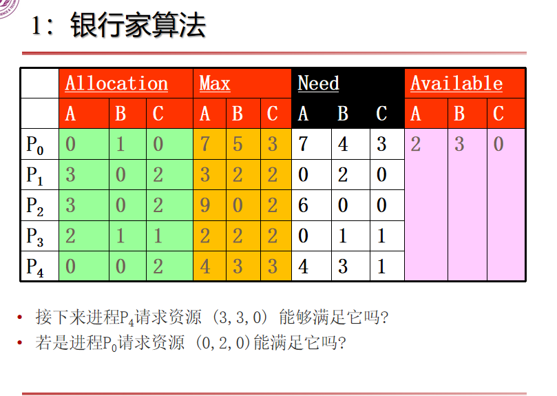

# 操作系统作业2
\[王子骏\ \ \ \ \ \ \ \ \ \ 9222127970152\]
## 第一题：银行家算法

##### 接下来进程$P_4$请求资源 (3,3,0) 能够满足它吗?
当前$Available=(2,3,0)$，而请求资源$(3,3,0)$，*只有$2$个$A$资源而$P_4$请求了$3$个*，无法满足。
##### 若是进程$P_0$请求资源 (0,2,0)能满足它吗?
1. *判断是否能够尝试分配*：
当前$Available=(2,3,0)$，而请求资源$(0,2,0)$，资源足够可以分配。
2. *尝试分配*：此时$Allocation[P_0] = (0,3,0)$，$Need[P_0]=(7,1,3)$，$Available=(2,1,0)$
3. *执行安全性算法*：
> 1. 首先构造$Work=Available=(2,1,0)$，$Finish=(F,F,F,F,F)$，其中$F$表示False，$T$表示True。
> 2. 对于$P_i(i \in [0,4])$判断是否有$Work=(2,1,0) > Need[p_i]$。
> 3. 可以发现，$Work=(2,1,0)$无法满足$P_0$的$A,C$需求；无法满足$P_1$的$B$需求；无法满足$P_2$的$A$需求；无法满足$P_3$的$C$需求；无法满足$P_4$的$ABC$需求；
> 4. 此时发现$Finish$向量全为False，进入死锁状态。
4. **安全性算法发现，若分配$(0,2,0)$给$P_0$会进入不安全状态，不分配**。
## 第二题

